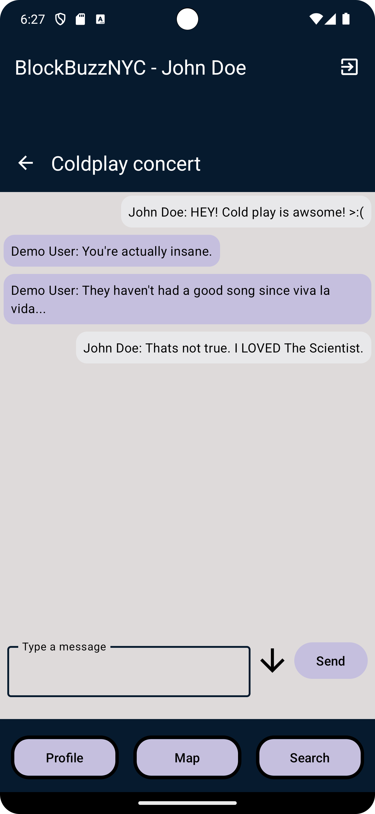

[Emulator Site](https://appetize.io/app/fabmjpjt7ndnscmhpfcttah4ou?device=pixel7&osVersion=13.0&deviceLocation=40.7128%2C-74.0060)

# BlockBuzzNYC

  
  
  
  
  

BlockBuzzNYC is a native Android app that leverages the power of JetPack Compose and Firebase to provide users with an interactive, real-time social mapping experience. Users can create and discover location-based pins, engage in live discussions, manage their profiles, and track achievements.

## Features

- **Create Pins**: Users can mark locations on the map with titles and descriptions, sharing their discoveries with the community.
- **Real-time Chat**: Each pin features a live chat where users can discuss and share information about the location in real-time.
- **User Profiles**: Personalized profiles with the ability to upload photos, view created pins, and track achievements.
- **Search Functionality**: Users can find pins by tags using an intuitive search feature.
- **Location Services**: The map centers on the user's current location, providing a personalized experience.

## Tech Stack

- **Frontend**: JetPack Compose
- **Backend**: Firebase
  - Authentication
  - Realtime Database
  - Storage for profile pictures
- **Location Services**: Integrated with Android's native location API.
  
## Future Additions

The following features are on the roadmap to be added to BlockBuzzNYC, aimed at enhancing user engagement and app functionality:

- **Notification System**: 
  - Implementing a notification system to alert users when their pins receive a significant number of likes or when they unlock new achievements.

- **Advanced Search Capabilities**:
  - Enhancing the search functionality to allow for location-based searches, enabling users to find pins not just by tags but also by proximity to their current or a specified location.

- **Community Moderation**:
  - Introducing a feature for users to request the deletion of pins that may be inappropriate or incorrect, thereby maintaining the quality and accuracy of the information shared within the app community.

- **Customized Pin Assets**:
  - Creating customized pin assets based on the tags given to pins, allowing greater ease of use directly from map screen.
  
These features are intended to create a more dynamic and interactive user experience, and we welcome feedback and suggestions from the community as we continue to develop and improve BlockBuzzNYC.
If you have any suggestions or would like to get in contact with me, feel free to [Email me](mailto:kcho760@gmail.com) or add me on [LinkedIn](https://www.linkedin.com/in/kevin-cho-441a34b1/)

